# Image-Handling-and-Pixel-Transformations-Using-OpenCV 

## AIM:
Write a Python program using OpenCV that performs the following tasks:

1) Read and Display an Image.  
2) Adjust the brightness of an image.  
3) Modify the image contrast.  
4) Generate a third image using bitwise operations.

## Software Required:
- Anaconda - Python 3.7
- Jupyter Notebook (for interactive development and execution)

## Algorithm:
### Step 1:
Load an image from your local directory and display it.

### Step 2:
Create a matrix of ones (with data type float64) to adjust brightness.

### Step 3:
Create brighter and darker images by adding and subtracting the matrix from the original image.  
Display the original, brighter, and darker images.

### Step 4:
Modify the image contrast by creating two higher contrast images using scaling factors of 1.1 and 1.2 (without overflow fix).  
Display the original, lower contrast, and higher contrast images.

### Step 5:
Split the image (boy.jpg) into B, G, R components and display the channels

## Program Developed By:
- **Name:** SANJAY C 
- **Register Number:** 212223240150

  ### Ex. No. 01

#### 1. Read the image ('Eagle_in_Flight.jpg') using OpenCV imread() as a grayscale image.
```python
img_bgr = cv2.imread("Eagle_in_Flight.jpg",0)
```

#### 2. Print the image width, height & Channel.
```python
img_bgr.shape
```

#### 3. Display the image using matplotlib imshow().
```python
plt.imshow(img_bgr,cmap="gray")
plt.title("Grayscale Image")
plt.axis("off")
plt.show()
```

#### 4. Save the image as a PNG file using OpenCV imwrite().
```python
img=cv2.imread('Eagle_in_Flight.jpg')
cv2.imwrite('Eagle.png',img)
```

#### 5. Read the saved image above as a color image using cv2.cvtColor().
```python
img=cv2.imread('Eagle_in_Flight.jpg')
cv2.imwrite('Eagle.png',img)
```

#### 6. Display the Colour image using matplotlib imshow() & Print the image width, height & channel.
```python
plt.imshow(img[:,:,::-1])
plt.show()
img.shape
```

#### 7. Crop the image to extract any specific (Eagle alone) object from the image.
```python
crop = img[20:430,200:550] 
plt.imshow(crop[:,:,::-1])
plt.title("Cropped Region")
plt.axis("off")
plt.show()
crop.shape
```

#### 8. Resize the image up by a factor of 2x.
```python
res= cv2.resize(crop,(200*2, 200*2))
```

#### 9. Flip the cropped/resized image horizontally.
```python
flip= cv2.flip(res,1)
plt.imshow(flip[:,:,::-1])
plt.title("Flipped Horizontally")
plt.axis("off")
```

#### 10. Read in the image ('Apollo-11-launch.jpg').
```python
img=cv2.imread('Apollo-11-launch.jpg',cv2.IMREAD_COLOR)
img_rgb = cv2.cvtColor(img, cv2.COLOR_BGR2RGB)
img_rgb.shape
```

#### 11. Add the following text to the dark area at the bottom of the image (centered on the image):
```python
text = cv2.putText(img_rgb, "Apollo 11 Saturn V Launch, July 16, 1969", (300, 700),cv2.FONT_HERSHEY_SIMPLEX, 1, (255, 255, 255), 2)  
plt.imshow(text, cmap='gray')  
plt.title("New image")
plt.show()  
```

#### 12. Draw a magenta rectangle that encompasses the launch tower and the rocket.
```python
rcol= (255, 0, 255)
cv2.rectangle(img_rgb, (400, 100), (800, 650), rcol, 3)  
```

#### 13. Display the final annotated image.
```python
plt.title("Annotated image")
plt.imshow(img_rgb)
plt.show()
```

#### 14. Read the image ('Boy.jpg').
```python
img =cv2.imread('boy.jpg',cv2.IMREAD_COLOR)
img_rgb= cv2.cvtColor(img, cv2.COLOR_BGR2RGB) 
```

#### 15. Adjust the brightness of the image.
```python
m = np.ones(img_rgb.shape, dtype="uint8") * 50
```

#### 16. Create brighter and darker images.
```python
img_brighter = cv2.add(img_rgb, m)  
img_darker = cv2.subtract(img_rgb, m) 
```

#### 17. Display the images (Original Image, Darker Image, Brighter Image).
```python
plt.figure(figsize=(10,5))
plt.subplot(131), plt.imshow(img_rgb), plt.title("Original Image"), plt.axis("off")
plt.subplot(132), plt.imshow(img_brighter), plt.title("Brighter Image"), plt.axis("off")
plt.subplot(133), plt.imshow(img_darker), plt.title("Darker Image"), plt.axis("off")
plt.show()
```

#### 18. Modify the image contrast.
```python
matrix1 = np.ones(img_rgb.shape, dtype="float32") * 0.7
matrix2 = np.ones(img_rgb.shape, dtype="float32") * 1.2
img_lower = cv2.multiply(img.astype("float32"), matrix1).clip(0,255).astype("uint8")
img_higher = cv2.multiply(img.astype("float32"), matrix2).clip(0,255).astype("uint8")
```

#### 19. Display the images (Original, Lower Contrast, Higher Contrast).
```python
plt.figure(figsize=(10,5))
plt.subplot(131), plt.imshow(img), plt.title("Original Image"), plt.axis("off")
plt.subplot(132), plt.imshow(img_lower), plt.title("Lower Contrast (0.7x)"), plt.axis("off")
plt.subplot(133), plt.imshow(img_higher), plt.title("Higher Contrast (1.2x)"), plt.axis("off")
plt.show()
```

#### 20. Split the image (boy.jpg) into the B,G,R components & Display the channels.
```python
b, g, r = cv2.split(img)
plt.figure(figsize=(10,5))
plt.subplot(131), plt.imshow(b, cmap='gray'), plt.title("Blue Channel"), plt.axis("off")
plt.subplot(132), plt.imshow(g, cmap='gray'), plt.title("Green Channel"), plt.axis("off")
plt.subplot(133), plt.imshow(r, cmap='gray'), plt.title("Red Channel"), plt.axis("off")
plt.show()
```

#### 21. Merged the R, G, B , displays along with the original image
```python
merged_rgb = cv2.merge([r, g, b])
plt.figure(figsize=(5,5))
plt.imshow(merged_rgb)
plt.title("Merged RGB Image")
plt.axis("off")
plt.show()
```

#### 22. Split the image into the H, S, V components & Display the channels.
```python
hsv_img = cv2.cvtColor(img, cv2.COLOR_RGB2HSV)
h, s, v = cv2.split(hsv_img)
plt.figure(figsize=(10,5))
plt.subplot(131), plt.imshow(h, cmap='gray'), plt.title("Hue Channel"), plt.axis("off")
plt.subplot(132), plt.imshow(s, cmap='gray'), plt.title("Saturation Channel"), plt.axis("off")
plt.subplot(133), plt.imshow(v, cmap='gray'), plt.title("Value Channel"), plt.axis("off")
plt.show()
```
#### 23. Merged the H, S, V, displays along with original image.
```python
merged_hsv = cv2.cvtColor(cv2.merge([h, s, v]), cv2.COLOR_HSV2RGB)
combined = np.concatenate((img_rgb, merged_hsv), axis=1)
plt.figure(figsize=(10, 5))
plt.imshow(combined)
plt.title("Original Image  &  Merged HSV Image")
plt.axis("off")
plt.show()
```

## Output:
### Read and Display an Image:
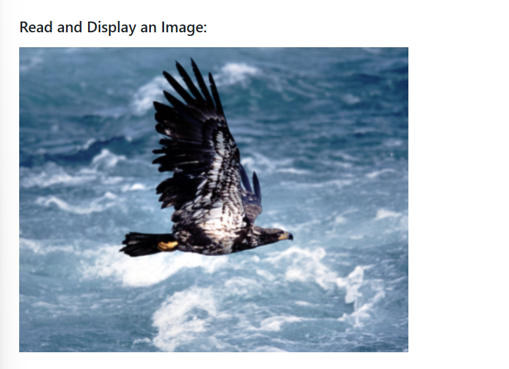
### Display the image as Grayscale image:
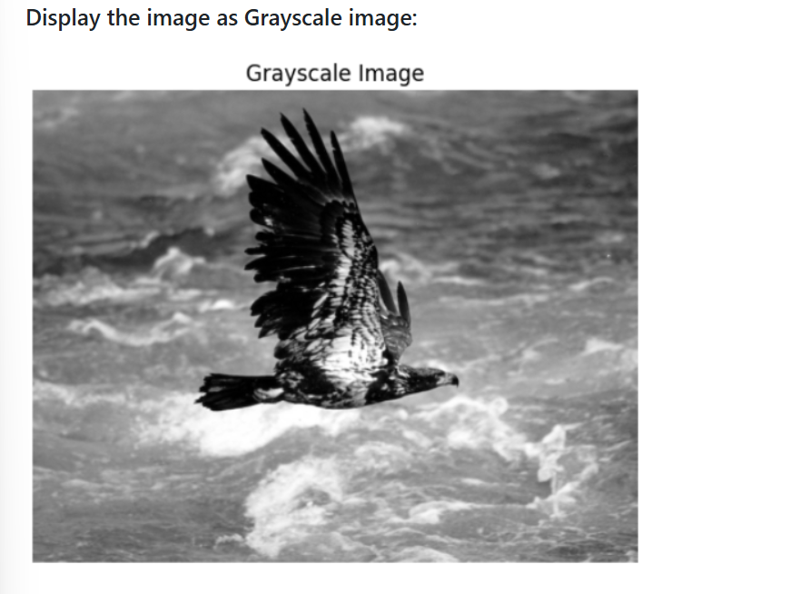

### Crop the image to extract any specific (Eagle alone) object from the image:

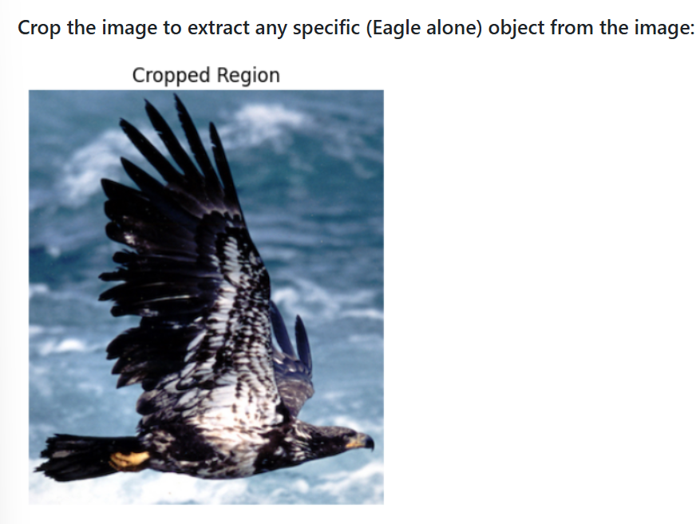

### Flip the cropped image horizontally:
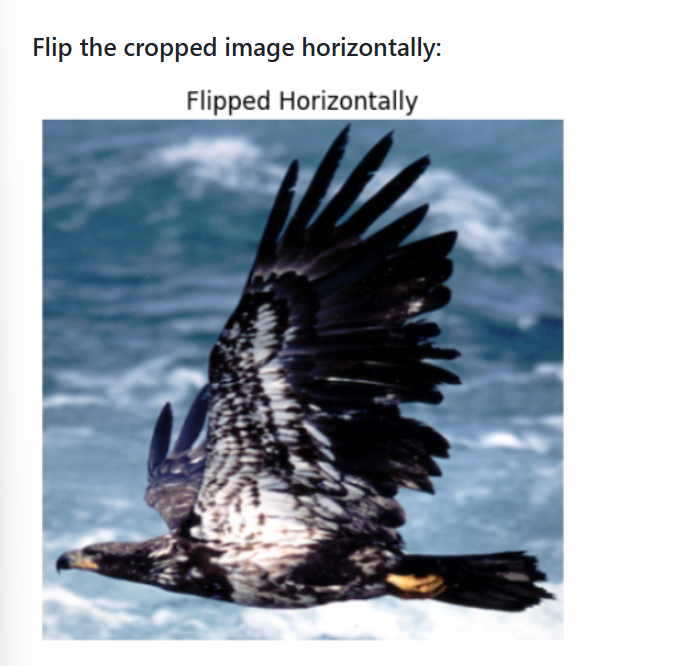

### Add the following text to the dark area at the bottom of the image (centered on the image):
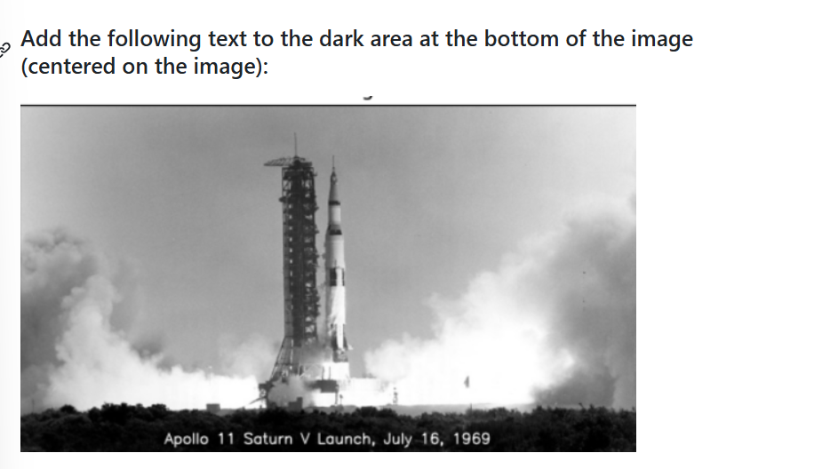

### Draw a magenta rectangle that encompasses the launch tower and the rocket.
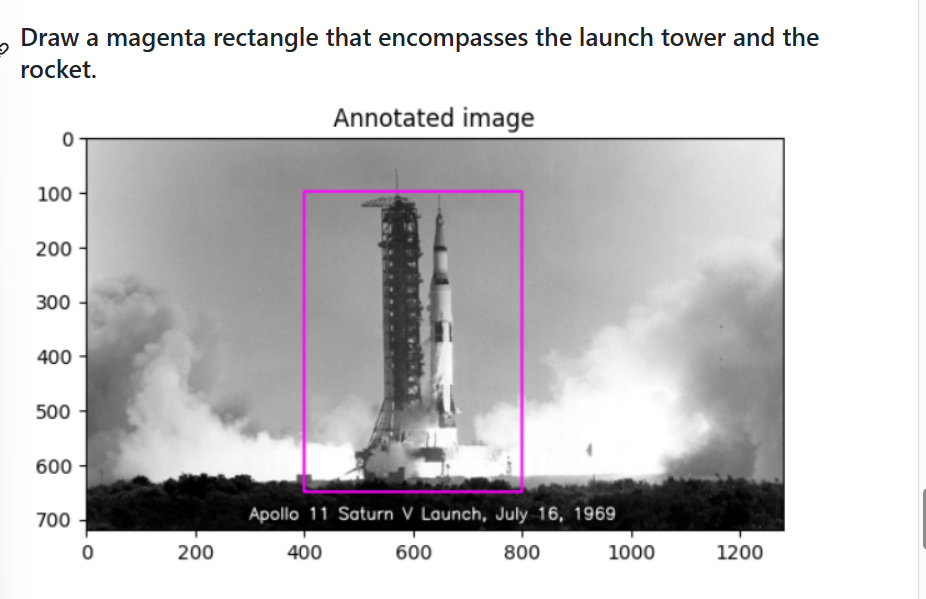

### Display the images (Original Image, Darker Image, Brighter Image).
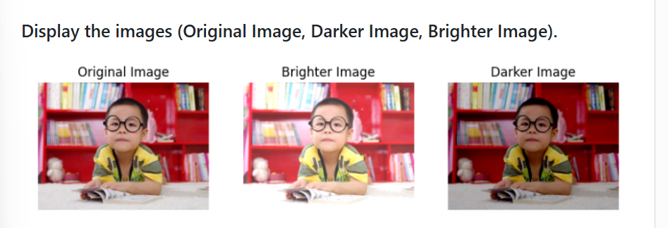

### Display the images (Original, Lower Contrast, Higher Contrast).
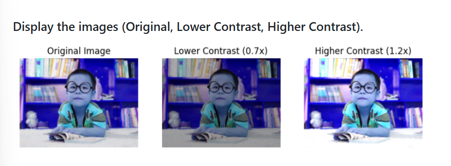

### Split the image (boy.jpg) into the B,G,R components & Display the channels.
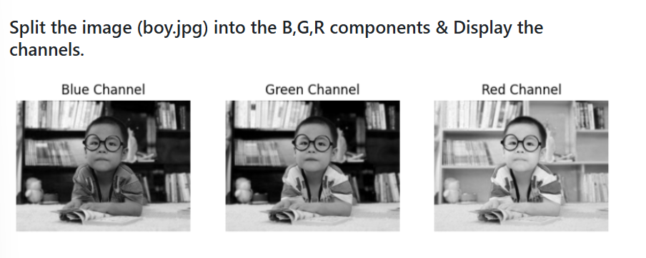

### Split the image into the H, S, V components & Display the channels.
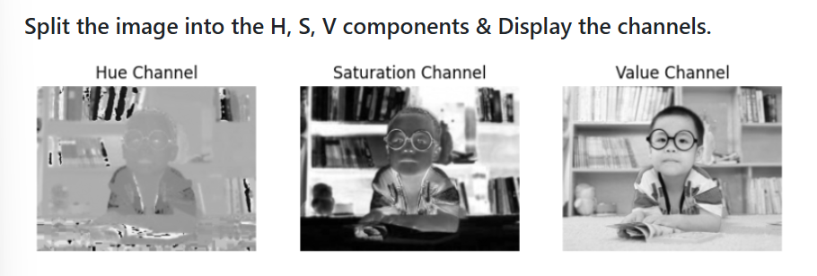
### Merged the H, S, V, display along with orginal image
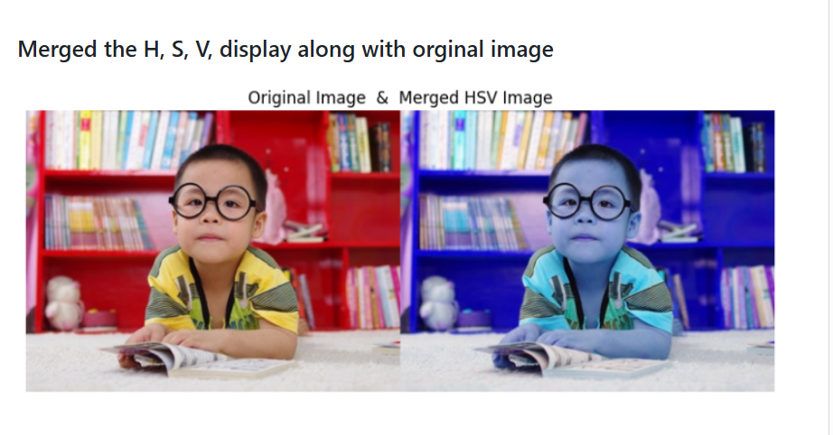
## Result:
Thus, the images were read, displayed, brightness and contrast adjustments were made, and bitwise operations were performed successfully using the Python program.